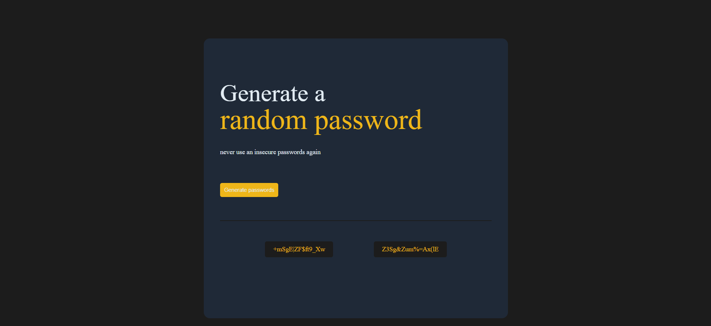

---

# 🔑 Password Generator

A lightweight **Password Generator Web App** built with **HTML, CSS, and JavaScript**.
Generate strong, secure, and customizable passwords instantly — perfect for keeping your accounts safe.

---

## 🌐 Live Demo

👉 **[Use Password Generator on Netlify](https://password-generator-for-security.netlify.app/)**

---

## 📸 Preview

<p align="center">  
    
</p>  

---

## ✨ Features

* 🔒 **Generate Random Passwords** – Strong and unique every time
* ⚡ **One-Click Copy** – Easily copy passwords to clipboard
* 🎨 **Simple & Responsive UI** – Clean design for desktop and mobile
* 🛠️ **Customizable** – Choose length, characters, and symbols (extendable)

---

## 🛠️ Tech Stack

* **HTML5** – Structure
* **CSS3** – Styling
* **JavaScript (ES6)** – Password generation logic

---

## 🚀 Getting Started

### 1. Clone the Repository

```bash
git clone https://github.com/srcastt/password-generator.git
```

### 2. Run Locally

Open `index.html` in your browser.

---

## 🎨 Customization

* Update styles in `style.css`
* Adjust password length, character sets, or add more rules in `script.js`

---

## 🔮 Future Enhancements

Here’s what I plan to add in the next version:

* ✅ **Copy Password Button** for quick copying to clipboard
* ✅ **Checkbox Options** for users to choose:

  * Include capital letters (A–Z)
  * Include small letters (a–z)
  * Include numbers (0–9)
  * Include special symbols (@, #, \$, etc.)
* ✅ **Password Strength Indicator** (Weak / Medium / Strong)

---

## 📜 License

This project is licensed under the **MIT License** — free to use and modify.

---

## 👤 Author

Made with ❤️ by **[srcastt](https://github.com/srcastt)**

---


